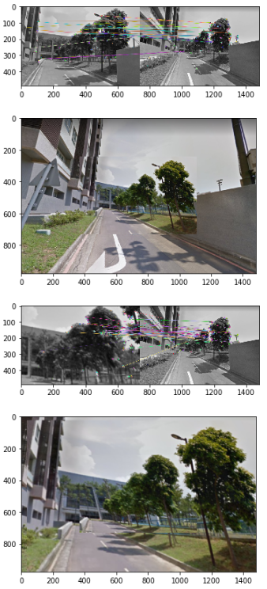
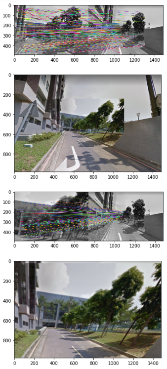
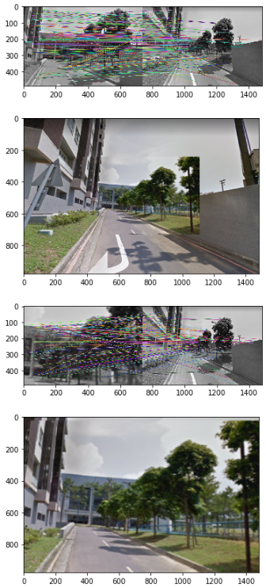

# homework4

## Take a sequence of moving-forward images in NTHU campus.

---
## Show feature extraction and matching results between two images
### Feature Extraction method : ORB(Oriented FAST and Rotated BRIEF)
* Theory： ORB 基本上是 FAST 與 ORiented BRIEF 的混合，並且增加一些修改來加強表現。先利用 FAST 來尋找 keypoint，接著利用 Harris corner 來取出前 N 個最好的 keypoint。 對每個 keypoint 附近區域的像素計算 weighted centroid(把這像素灰階值當作weight)，從 keypoint 到 centroid 的方向即為該 keypoint 的 orientation。

* the moments of a patch are defined as

* the “center of mass(centroid)” of the patch as:

* The orientation of the patch is then given by

### matching results between two images

---
## Perform image alignment and generate infinite zooming effect
### ORB

### SIFT

### SURF

## Implement different feature extrators
### ORB

### xfeature2d SIFT

### SURF

## Exploit creativity to add some image processing to enhance effect.
通常照片無法對的很剛好，容易將不相干的內容放在一起，因此照片的邊框非常明顯。為了消除邊框，這裡我們使用blur的技巧，將銳利的邊框消除。以下為套用之後的結果:
  
可以看到邊框基本上已經看不到了，但圖片本身也受到很大的影響。

